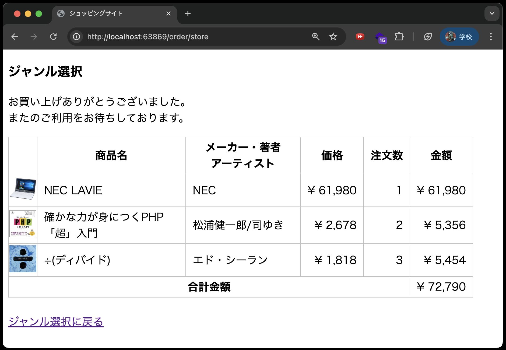

# 注文画面の仕様



- 注文した商品を表示する

## ①データベース環境構築

新しくソースコードをcloneしたので、再度データベース環境構築をする必要があります。
本章から新たに追加される`orders`テーブルと`orderdetails`テーブルに関しては、マイグレーションファイルを作成します。

### ①-1 マイグレーション

新たに、注文情報を管理するための`orders`テーブル、注文明細情報を管理するための `orderdetails`テーブルを作成します。

**テーブル名：orders**

| カラム名 | データ型 | 制約 | 備考 |
| - | - | - | - |
|orderId|int型|主キー、auto_increment|注文番号|
|orderdate|datetime型||注文日時|

**テーブル名：orderdetails**

| カラム名 | データ型 | 制約 | 備考 |
| - | - | - | - |
|orderId|int型|主キー|注文番号(テーブルordersのorderId)|
|itemId|int型|主キー|商品番号|
|quantity|int型||注文数|

※primary keyは「orderId」と「itemId」の複数列を使った複合主キーとします。

1. VSCode上で、`Ctrl+Shift+P`(Macの場合は`Cmd+Shift+P`)を押し、コンテナを起動する(既に起動しているなら不要)
2. VSCode上で、`Ctrl+J`(Macの場合は`Cmd+J`)を押し、ターミナルを表示する
3. 以下のコマンドを実行して、`orders`テーブル、`orderdetails`テーブル用のマイグレーションファイルを作成する

```bash
php artisan make:migration create_orders_table

php artisan make:migration create_orderdetails_table
```

4. 以下のファイルが作成されていることを確認する
   - `database/migrations/20xx_xx_xx_xxxxxx_create_orders_table.php`
   - `database/migrations/20xx_xx_xx_xxxxxx_create_orderdetails_table.php`

5. 作成したマイグレーションファイルのupメソッドを編集する

    **database/migrations/20xx_xx_xx_xxxxxx_create_orders_table.php**

    ```php
    public function up(): void
    {
        Schema::create('orders', function (Blueprint $table) {
            $table->integer('orderId')->autoIncrement()->primary();
            $table->dateTime('orderdate');
        });
    }
    ```

    **database/migrations/20xx_xx_xx_xxxxxx_create_orderdetails_table.php**

    ```php
    public function up(): void
    {
        Schema::create('orderdetails', function (Blueprint $table) {
            $table->integer('orderId');
            $table->integer('itemId');
            $table->integer('quantity');
            $table->primary(['orderId', 'itemId']); // 複合主キーの設定
            $table->foreign('orderId')->references('orderId')->on('orders')->onDelete('cascade');
            $table->foreign('itemId')->references('ident')->on('items')->onDelete('cascade');
        });
    }
    ```

6. 以下のコマンドを実行して、各種テーブルを一括で作成する

    ```bash
    php artisan migrate:fresh --seed
    ```

## ②モデルの作成

`orders`テーブルに対応する`Order`モデルと、`orderdetails`テーブルに対応する`Orderdetail`モデルを作成します。

1. VSCode上で、`Ctrl+Shift+P`(Macの場合は`Cmd+Shift+P`)を押し、コンテナを起動する(既に起動している場合は不要)
2. VSCode上で、`Ctrl+J`(Macの場合は`Cmd+J`)を押し、ターミナルを表示する
3. 以下のコマンドを実行して、`Order`モデルを作成する

   ```bash
   php artisan make:model Order
   ```

4. 以下のファイルが作成されていることを確認する
    - `app/Models/Order.php`
5. 以下のコマンドを実行して、`Orderdetail`モデルを作成する

    ```bash
    php artisan make:model Orderdetail
    ```

6. 以下のファイルが作成されていることを確認する
7. `app/Models/Orderdetail.php`
8. 作成したモデルファイルを以下のように編集する

    **app/Models/Order.php**

    ```php
    <?php

    namespace App\Models;

    use Illuminate\Database\Eloquent\Factories\HasFactory;
    use Illuminate\Database\Eloquent\Model;

    class Order extends Model
    {
        use HasFactory;

        // 主キーをorderIdに設定(穴埋め)
        protected 
        // タイムスタンプを無効に(穴埋め)
        public 
        // 代入可能なカラム(orderdate)を指定(穴埋め)※主キーのorderIdはauto_incrementのため指定不要
        protected 
    }
    ```

    **app/Models/Orderdetail.php**

    ```php
    <?php

    namespace App\Models;

    use Illuminate\Database\Eloquent\Factories\HasFactory;
    use Illuminate\Database\Eloquent\Model;

    class Orderdetail extends Model
    {
        use HasFactory;

        // 複合主キーをorderIdとitemIdに設定※複合主キー場合は配列で指定
        protected $primaryKey = ['orderId', 'itemId'];
        // タイムスタンプを無効に(穴埋め)
        public 
        // 代入可能なカラム(orderId, itemId, quantity)を指定(穴埋め)
        protected 
    }
    ```

## ③コントローラの作成

注文機能を実装するために、以下の2つのメソッドをコントローラに実装します。

- 注文データを保存する`store`メソッド
- 注文リストを表示する`index`メソッド

### ③-1 OrderControllerを作成する

---

今回は`OrderController`を作成します。
`OrderDetailController`を作成しない理由は、以下の2つです。

- 注文機能という機能単位でコントローラを作成しているため
- コントローラ内で注文テーブル(`orders`)と注文明細テーブル(`orderdetails`)のデータを同時に扱う必要があるため

それでは、`OrderController`を作成します。

1. 以下のコマンドを実行して、`OrderController`を作成する

    ```bash
    php artisan make:controller OrderController
    ```

2. 作成したコントローラファイルに`index`メソッドと`store`メソッドを追加する

    **app/Http/Controllers/OrderController.php**

    ```php
    <?php

    namespace App\Http\Controllers;

    use Illuminate\Http\Request;
    // Cartモデルを使用するためのuse文を追加(穴埋め)
    use 
    // Orderモデルを使用するためのuse文を追加(穴埋め)
    use 
    // Orderdetailモデルを使用するためのuse文を追加(穴埋め)
    use 

    class OrderController extends Controller
    {

        public function index($carts)
        {
            // 注文画面のビューを表示(穴埋め)
            return 
        }

        public function store()
        {
            // カート内の全ての商品を取り出す(穴埋め)
            $carts = 

            // 注文テーブルに登録(注文日時はdate("Y-m-d H:i:s")で取得)
            $order = 

            // 注文明細テーブルに登録(複合主キーのためinsertメソッドを使用)
            foreach ($carts as $cart) {
                $orderdetail = Orderdetail::insert([
                    // 注文番号を指定(穴埋め)
                             => 
                    // 商品番号を指定(穴埋め)
                             => 
                    // 注文数を指定(穴埋め)
                             => 
                ]);
            }
            // カート内のすべての商品を削除
            Cart::truncate();
            // indexメソッドを呼び出す
            return $this->index($carts);
        }
    }
    ```

    **【解説】**

    `$orderdetail = Orderdetail::insert([ ... ]);`: <br>
    注文明細データを作成しています。
    今まで使用していた`create`メソッドでは複合主キーを設定できないため、`insert`メソッドを使用しています。

    `Cart::truncate();`: <br>
    `truncate`メソッドは、テーブル内の全てのレコードを削除します。

    `return $this->index($carts);`: <br>
    `OrderController`の`index`メソッドを呼び出しています。
    引数には、カート内の商品情報を渡しています。

## ④ルーティングとカート内の商品画面の修正

### ④-1 ルーティング

---

`routes/web.php`に以下の観点からルーティングを追加します。

- `GET`リクエスト時に`OrderController`の`store`メソッドを呼び出すルートを追加する
- マッピングするURLを`order/store`に設定する
- ルーティングの名前を`order.store`に設定する

### ④-2カート内の商品画面の修正

---

「注文する」リンクに先ほど[④-1 ルーティング](#④-1-ルーティング)で設定したルートを設定します。

## ⑤ビュー(注文画面)の作成

1. `resources/views`ディレクトリに`order`ディレクトリを作成する
2. `order`ディレクトリに`index.blade.php`を作成し、以下のように記述する

    **resources/views/order/index.blade.php**

    ```php
    <!DOCTYPE html>
    <html lang="ja">
    <head>
        <meta charset="UTF-8">
        <meta name="viewport" content="width=device-width, initial-scale=1.0">
        <link rel="stylesheet" href="{{ asset('css/minishop.css')}}">
        <title>ショッピングサイト</title>
    </head>
    <body>
        <p>お買い上げありがとうございました。<br>
            またのご利用をお待ちしております。</p>
        <table>
            <tr>
                <th>&nbsp;</th>
                <th>商品名</th>
                <th>メーカー・著者<br>アーティスト</th>
                <th>価格</th>
                <th>注文数</th>
                <th>金額</th>
            </tr>
            @php
                $total = 0;
            @endphp
            @foreach( $carts  as  $cart )
                <tr>
                    <td class="td_mini_img">item->image )}}"></td>
                    <td class="td_item_name"> {{ $cart->item->name }} </td>
                    <td class="td_item_maker"> {{ $cart->item->maker }} </td>
                    <td class="td_right">&yen; {{  number_format( $cart->item->price) }} </td>
                    <td class="td_right"> {{ $cart->quantity }} </td>
                    <td class="td_right">&yen; {{ number_format( $cart->item->price * $cart->quantity) }}</td>
                </tr>
                @php
                    $total += $cart->item->price * $cart->quantity;
                @endphp
            @endforeach
            <tr>
                <th colspan="5">合計金額</th><td class="td_right">&yen; {{ number_format($total) }}</td>
            </tr>
        </table>
        <br>
        <a href="{{ route('index') }}">ジャンル選択に戻る</a>
    </body>
    </html>
    ```
    

## ⑤動作確認

以下のようにジャンル選択画面から注文画面まで遷移できることと、データベースの生合成が取れていることを確認してください。